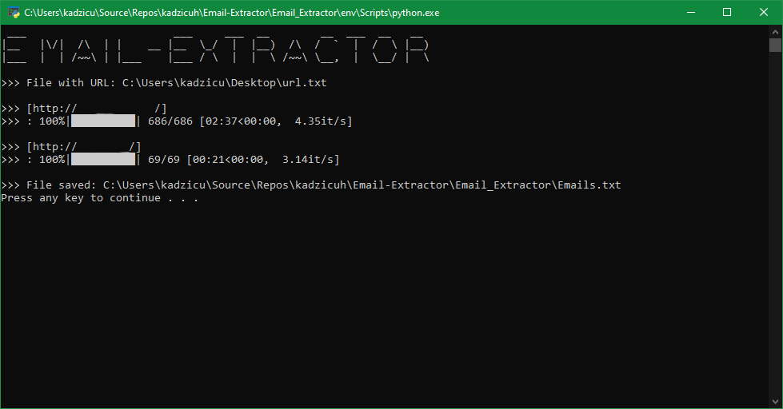

# DISCLAIMER
**Email-Extractor is for education/research purposes only. The author takes NO responsibility and/or liability for how you choose to use any of the tools/source code/any files provided.
 The author and anyone affiliated with will not be liable for any losses and/or damages in connection with use of ANY files provided with Email-Extractor.
 By using Email-Extractor or any files included, you understand that you are AGREEING TO USE AT YOUR OWN RISK. Once again Email-Extractor files included are for EDUCATION and/or RESEARCH purposes ONLY.
 Email-Extractor is ONLY intended to be used on your own pentesting labs, or with explicit consent from the owner of the property being tested.** 

## Email-Extractor
Free utility to extract email address by scanning a given URL

[](LICENSE)
[](https://www.python.org/downloads/release/python-378/)
[](https://codeclimate.com/github/kadzicuh/Email-Extractor/maintainability)

## 📃 Requirements
* 📌 Python
  * ✔️ >= 3.7
* 📌 Libraries
  * ✔️ beautifulsoup4
  * ✔️ certifi
  * ✔️ chardet
  * ✔️ idna
  * ✔️ requests
  * ✔️ soupsieve
  * ✔️ urllib3
  * ✔️ tqdm

## 📃 Usage:
```
pip install -r requirements.txt

python Email_Extractor.py
```

## 📷 Screenshot:


## 📃 License
Email-Extractor is distributed under the [MIT License](LICENSE).
